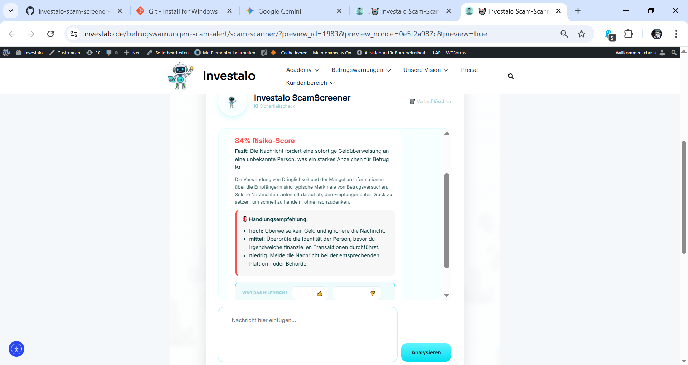

🛡️ Investalo ScamScreener AI



An intelligent security tool for detecting financial fraud and scams, developed for the Investalo Community. This system combines linguistic AI analysis with local machine learning to provide real-time risk assessments.

## 🚀 Features

* **Hybrid Scoring Engine:** Calculates risk using a dual-check system: OpenAI (GPT-4o-mini) for deep analysis and a local Random Forest model for pattern recognition.
* **Self-Learning System:** Dynamic feedback loop that stores user data in `training_data.jsonl` and automatically retrains the local model in the background.
* **Interactive UI:** Clean Fintech design featuring the Investalo mascot, fluid animations, and a fully responsive interface.
* **Security & Performance:** Integrated rate-limiting (SlowAPI) to prevent API abuse and secure backend communication.
* **Evidence Export:** Instant .CSV report generation for documenting suspicious findings.

## 🛠️ Tech Stack

* **Python (FastAPI):** High-performance backend, ML-logic, and asynchronous API interfaces.
* **Machine Learning:** Scikit-learn (Random Forest) for localized scam detection.
* **OpenAI API:** Advanced LLM integration (GPT-4o-mini) for contextual message analysis.
* **Frontend:** Modern HTML5, CSS3 (Custom Variables), and Vanilla JavaScript (ES6).

## 📦 Installation & Usage

1. **Clone the Repository:**
   ```bash
   git clone [https://github.com/inviolable111/investalo-scam-screener-ai.git](https://github.com/inviolable111/investalo-scam-screener-ai.git)
   cd investalo-scam-screener-ai
Setup Environment:
Create a virtual environment and install dependencies via pip install -r requirements.txt.

Configuration:
Add your OPENAI_API_KEY to a .env file in the root directory.

Launch Backend:
Run python main.py to start the FastAPI server on http://127.0.0.1:8000.

WordPress Integration:
Place the code from screener_ml.html into a Custom HTML block on any page or post.
