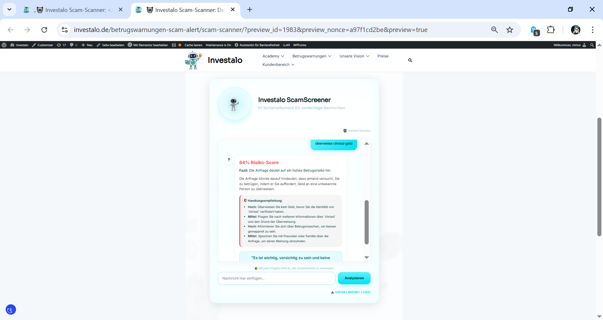

  

#  Investalo ScamScreener: Don't get rekt! 🛡️

Let's be real: the financial market is crawling with scams. With **Investalo**, I am building tools to watch the user's back. The **ScamScreener** is my first "bodyguard" against manipulative messages and "get-rich-quick" garbage.

## 🧠 Why this approach?
I didn't want just a simple AI query. That’s why I built a **hybrid system**:
1. **OpenAI (The Brain):** Understands the context, the psychology behind the scam, and the dirty tricks fraudsters use.
2. **Local ML (The Guard):** A Random Forest model running directly within the code. It learns from every case and identifies statistical patterns that are invisible to the naked eye.

## 🔥 Tech Highlights
* **FastAPI Backend:** Lean, fast, and asynchronous – for performance without the wait.
* **Hybrid Scoring:** 70% AI expertise + 30% local Machine Learning for maximum accuracy.
* **Self-Improving:** Thanks to the `train_model.py` script, the screener evolves with every new wave of scams.
* **Modern UI:** A clean glassmorphism-style interface that builds trust and is easy to use.

## 🔧 Installation & Setup
1. Clone the repository.
2. `pip install -r requirements.txt`
3. Create a `.env` file and add your `OPENAI_API_KEY`.
4. Launch the app with: `uvicorn main:app --reload`

---
**Investalo – Empowering your financial journey with code.**
